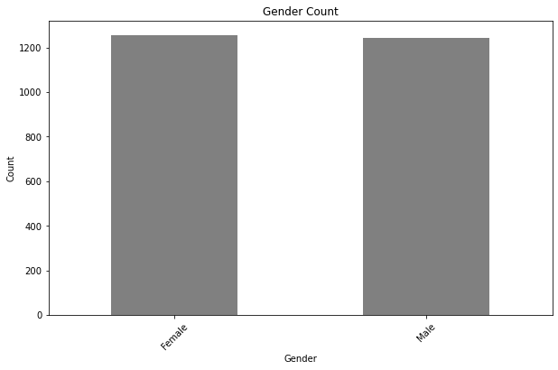
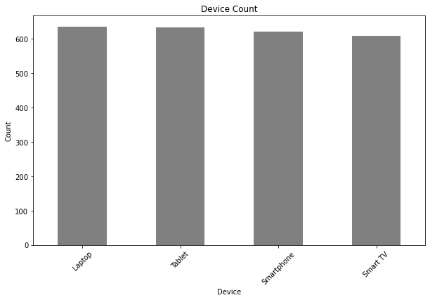
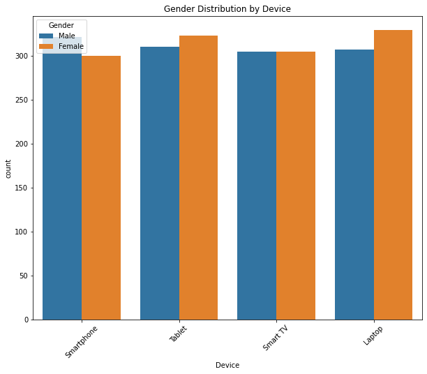

# Objective
### The goal of this analysis is to understand the usage patterns of netflix users, calculate key metrics like life time values, and discover insights using varies attributes like Age, Gender, Device, Subscription Type among others ###

Check out the query here [NETFLIX_USER_BASE_REPORT folder](/Netflix_User_base%20Analysis%20Report.ipynb)

# Background
The dataset consist of the following columns:
- **User ID** which is unique in our table.
- **Subscription Type** Which consist of Basic - *price is affordable and ad-free*, Standard - *price is mid-range and resolution Full HD*, and Premium-*price is highest, No Ad-supported and 4K Ultra HD + HDR Resolution* netflix users.
- **Monthly Revenue** The amount of revenue each user pay based on his/her subscription package.
- **Join Date** The date which the user joined Netflix.
- **last Payment Date** The last date when the user made subscription payment.
- **Country** The country where the user's live.
- **Age** The age of user.
- **Gender** Consist of Female or Male Netflix users.
- **Device** The device consist of:
1.Laptop.
2.Smart TV.
3.Tablet.
4.Smartphone.
- **Plan Duration** The timeframe the user enrolled to Netflix.

# Tools I used.
- Visual Studio Code: For database management and executing queries.
- Git and Github: For version control and sharing queries and analysis.

# Metrics and Analysis 


``` python
[count of Gender, Device, Subscription Type](\columns_title = {"Country":"Country Count",
                "Gender": "Gender Count",
                "Device" : "Device Count",
                "Subscription Type" : "Subscription Count"
                }
for column, value in columns_title.items():
    plt.figure(figsize = (10, 6))
    df[column].value_counts().plot(kind = "bar", color = "grey")
    plt.title(value)
    plt.xlabel(column)
    plt.ylabel("Count")
    plt.xticks(rotation = 45)
    plt.show())
```
a. Netflix user per Country.
United States has the reading Netflix User, Spain, Canada second and third respectively, and Italy with the least Netflix Users.


*Bar graph representing country by the number of users*

```python
sub_by_country['Total'] = sub_by_country.sum(axis = 1)
```
sub_by_country
| Country     | Total      |
|-------------|------------|
|United States|  451       |
|Spain        |  451       |
|Canada       |  371       |
|United Kingdom| 183       |
|Australia    |  183       |
|Germany      |  183       |
|France       |  183       |
|Brazil       |  183       |
|Mexico       |  183       |
|Italy        |  183       |


b. Netflix user by gender count
The number of male and female are equal in terms to Netflix user according to gender attribute.
The number of Females netflix users are majority in the following countries Brazil, German, Spain, Spain, and United Kingdom as of the table below.

```python
gender_by_country = df.pivot_table(index = "Country", columns = 'Gender', values = 'User ID', aggfunc = 'count',
                                  fill_value = 0)
gender_by_country
```
*A table showing the Number of Netflix user in terms of Gender as per Country*
| Country  | No of Female| No of Male|
|----------|-----------|-------------|
|Australia |  89       |     94      |
|Brazil    |  94       |     88      |
|Canada    |  157      |     160     |
|France    |  91       |     92      |
|German    |  94       |     89      |
|Italy     |  91       |     92      |
|Mexico    |  89       |     94      |
|Spain     |  233      |     218     |
|United Kingdom| 93    |     90      |
|United State | 225    |     226     |



*Bar graph representing netflix users in terms of Female and Male*

c. Netflix device users
Laptop and Tablet top the lists of netflix device users with 636 and 633 users and the least being Smart TV with 610 users.

- Number of Netflix users by Device


```python
Number_of_device = df['Device'].value_counts().sort_values(ascending = False)
Number_of_device
```
The number of devices used by our Netflix users are:
|Device    | Number of Device |
|----------|------------------|
|Laptop    |  636             |
|Tablet    |  633             |
|Smartphone|  621             |
|Smart TV  |  610             |

- Revenue by Netflix device users
```python
plt.figure(figsize = (10,6))
device_revenue.plot(kind = "bar", color = "green")
plt.title('Revenue by Device')
plt.xlabel('Device')
plt.ylabel('Revenue')
plt.xticks(rotation = 45)
plt.show()
```

*Bar graph of revenue generated from Netflix device users*

- Netflix device users by gender.
The most optimal device for female are tablet and laptop, and male dominating smartphones.

```python
#Gender distribution by device
plt.figure(figsize = (10, 8))

sns.countplot(x = 'Device', hue = 'Gender', data = df)
plt.title('Gender Distribution by Device')
plt.xticks(rotation= 45)
plt.show()
```

*Bar graph of count of device by gender


d. subscription per country
United States tops with 199 basic netflix users, United Kingdom with 199 Standard netflix users, and Spain with 212 premium netflix users
```python
plt.figure(figsize = (10,6))
sns.countplot(data = df, x = 'Country', hue = "Subscription Type", palette = "Set2")
plt.title('Subscription by Country')
plt.xticks(rotation = 45)
plt.show()
```

*Bar graph of subscription per country*

```python
user_count_by_country = df['Country'].value_counts().reset_index()
user_count_by_country.columns = ['Country', 'User Count']

#import plotly.express library
import plotly.express as px
fig = px.choropleth(user_count_by_country, locations = "Country", locationmode = "country names", color = "User Count",
                   hover_name = "Country", title = 'User Distribution By Country',
                   color_continuous_scale = px.colors.sequential.Plasma)
fig.update_layout(
    width = 1000,
    height = 400,
    title_font_size = 24,
    geo = dict(
        showframe = False,
        showcoastlines = False
    )
)

fig.show()
```

*subscription map*

# What I Learned
- I mastered the art of advanced python and visualization.
- I advanced solving skills, and finding insightful skills.

# Conclusions.
i.United States and Spain top the list of netflix users with a total of 451 users. Spain has the highest Premium Netflix users with a total of 212 users where marketers can target Spain with premium promotions for premium netflix users , basic promotions targeted to United States which has the highest basic users with a total of 199,  and lastly, standard promotions to United Kingdom with a total of 180  Netflix users.

ii. Laptop is the most used device by Neflix users, and the highest source of revenue among the device.

iii. The number of males and females are equal in terms of Netflix subscription. 

iv. The country with the highest revenue is United State and the country with highest average revenue is United Kingdom.

# Closing Thoughts
This project enhanced my skills and provided valuable insights into data science job market. The findings from the analysis guide to prioritizing skills development and search efforts..


